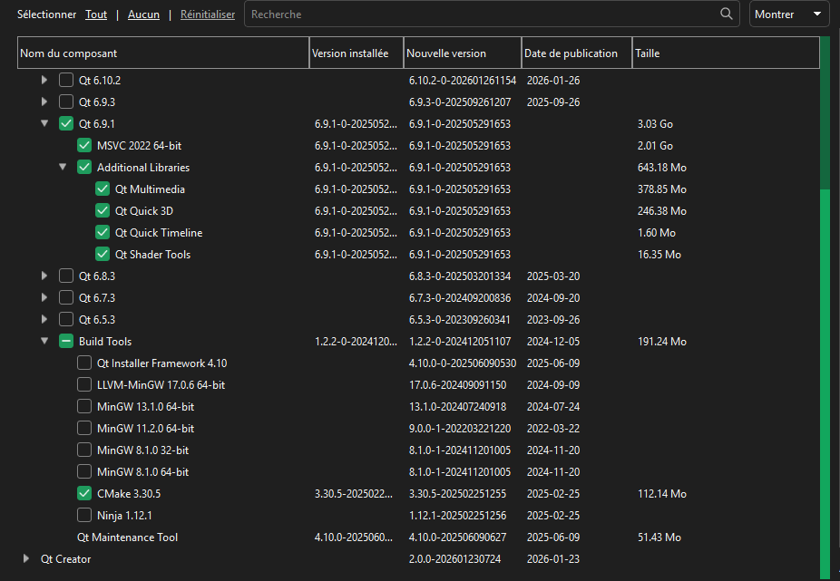

# OoTMMCombo-Tracker

An auto-tracker for the [OoTMM combo](https://ootmm.com/) randomizer.\
It automatically detects which location you collect and displays the item it contained on interactive scene maps — just like filling in the spoiler log yourself, but live, graphical and effortless.

In **singleplayer**, tracking now works entirely through **hooking**: the tracker injects itself into a custom Project64 build and intercepts game events in real time (no lua adapter script needed anymore).\
In **multiplayer**, it is a fork of the [multi-client](https://github.com/OoTMM/multi-client) written by Nax and talks to a remote server, exactly as before.

# Requirements

- **[Project64-EM 1.0.3-PJ-3.0.1](https://github.com/OoTMM/Project64-EM/releases)** — 1.0.3 or 1.1.0 build is required (it is the only ones the hook supports).
- `PJ64Injector.exe` and `PJ64OoTMMTracker.dll` must be in the **same folder** as the tracker (the tracker injects them automatically when you start tracking).
- **OoTMM build**: the tracker targets the latest **dev** build (currently `dev-98a1ac3`). It also supports the **stable release 30.1**, and should keep working with newer dev builds.

# Features

- Real-time item tracking for both **Ocarina of Time** and **Majora's Mask** on interactive scene maps
- Full **entrance randomizer** tracking — entrances, grottos, warp songs, spawns, deaths — with entrance maps, region/entrance trees and a GPS view
- A **progression tab** listing every item and the locations where each one can be found
- **Spoiler-log support**: reveal uncollected item locations and pre-mark starting items
- **Master Quest** and **Majora's Mask JP** layouts are supported
- **Coop, multiplayer and multiworld** are supported (per-world scene maps + a world selector)
- ROM build parameters are parsed automatically from the spoiler log to enable/disable the right locations
- Auto-save: progress is saved every time an item is collected (manual save is also available)

# How to use

## Playing in singleplayer

1. Launch **Project64-EM (1.0.3-PJ-3.0.1 or 1.1.0-PJ-3.0.1)** and start your OoTMM ROM.
2. In the tracker's **"Launch"** tab, click **"Start Tracking"** — the tracker injects its hook into Project64.
3. Create a new save and start playing. Collected items appear on the maps automatically.

There is an auto-saving feature, enabled by default. When an item is collected the progress is saved.\
You can also save your progress manually.

## Playing in multiplayer

Your ROM must have been created with the **coop** or **multiworld** parameter.

In the **"Launch"** tab, check the **"Use multiplayer"** box and enter the server address and port you want to use.\
If you don't have your own server, just leave the default one.\
Then follow the **"Playing in singleplayer"** steps above.

## Loading a spoiler log (strongly recommended)

Importing the seed's spoiler log is **strongly recommended**. It is the most reliable way to detect the ROM build (stable vs dev), and it is the **only** way the tracker learns the world layouts — Master Quest and Majora's Mask JP — which the hook cannot detect on its own.

It also lets the tracker show the expected item on each location, reveal uncollected item locations, and account for starting items.

## Side notes

- Tracking is **live**: items collected while the tracker is not running (or before injection) are not detected.
- Master Quest and Majora's Mask JP layouts are supported, but the hook **cannot** detect them — they are read from the spoiler log, so import it to get the correct layouts (see the spoiler-log section above).
- Multiworld is fully supported — use the world selector to browse any world's map and progression.

<code style="color : red">Dev version above V32.0 are poorly supported right now, mainly due to fact that a lot of changes that impact AddItem functions, entrance variables and new multiplayer system have been done.</code>

## Troubleshooting

Your antivirus may consider the PJInjector.exe as virus. This is mainly due to the fact that this program will inject code into Project64 memory using method that are commonly used by hackers to add malicious code inside programs. While I can assure you that I'm not going to infect your computer you can still check the source code or even put the program on VirusTotal (15/71 will detect it as malicious). I'm working on it to make it more acceptable.\
However if you are confident enough you can add an exception to your antivirus program (do not disable it entirely !). Here are the steps under Windows 11 using Window defender:
- Click on the Start button.
- Click on Settings.
- Click on Update & Security.
- Click on Windows Security.
- Click on Virus & threat protection.
- Click on Manage settings underneath Virus & threat protection settings.
- Go to the bottom and click on Add or Remove exclusions and select your OoTMMAutoTracker path folder.

If you are unable to unzip the PJ64Injector.exe try the following:
- Click on the Start button.
- Click on Settings.
- Click on Update & Security.
- Click on Windows Security.
- Click on Virus & threat protection.
- Then you should see protection history or something like that.
- Then you will see the list of recently action the antivirus has taken.
- Look for the one matching the tracker path.
- If this is a quarentine threat you should have an action button on the bottom right.
- If so click restore.

# For the dev

The solution is built with **Visual Studio 2022 (v143)** — no CMake, no Makefile — and contains three projects that build independently:

- **Main tracker app** (root `.vcxproj`) — the Qt GUI application
- **PJ64Injector** (`PJ64Injector/`) — CLI tool that injects the tracking DLL into Project64
- **PJ64OoTMMTracker** (`PJ64Tracking/PJ64OoTMMTracker/`) — the Windows DLL that hooks Project64 internals

Building requires **[Qt 6.9.1](https://www.qt.io/development/download-qt-installer-oss)** installed and linked (the Qt libraries are dynamically linked).
The installation settings used are the following

Once you have built the project you can use the following command to run the .exe without the need of the IDE:
- **For the release version** : windeployqt --release <path_to_the_release_folder>/OoTMMCombo-Tracker.exe
- **For the debug version** : windeployqt --debug <path_to_the_debug_folder>/OoTMMCombo-Tracker.exe

# 📜 Licenses used in this project

## Main license
This project is licensed under the **GNU General Public License v3.0 (GPLv3)**. See the `LICENSE` file for more information.

## Qt and the LGPL
This project uses the **Qt** library, which is distributed under the **LGPL v3** license.
Under the terms of the LGPL, users are allowed to **replace or modify** the Qt libraries used.

The Qt libraries can be obtained from the official website:
[https://www.qt.io/download](https://www.qt.io/download)

### LGPL obligations:
- The Qt libraries used in this application are **dynamically linked**.
- The user may replace these libraries with another compatible version.
- The LGPL v3 license is included in the file `LGPL-3.0.txt`.

### MIT obligations:
Some of the code in this project comes from software under **MIT License**.
- Parts of this project (all files under the `Sources/Multi` and `Headers/Multi` folders) are a fork from the [OOTMM multi-client](https://github.com/OoTMM/multi-client) project.
- The full MIT License is included in the file `MIT-LICENSE.txt`.

## License files
- `LICENSE` → Main license (GPLv3).
- `LGPL-3.0.txt` → Text of the LGPL v3 license (provided with Qt or downloadable [here](https://www.gnu.org/licenses/lgpl-3.0.txt)).
- `MIT-LICENSE.txt` → Multi-Client fork.
